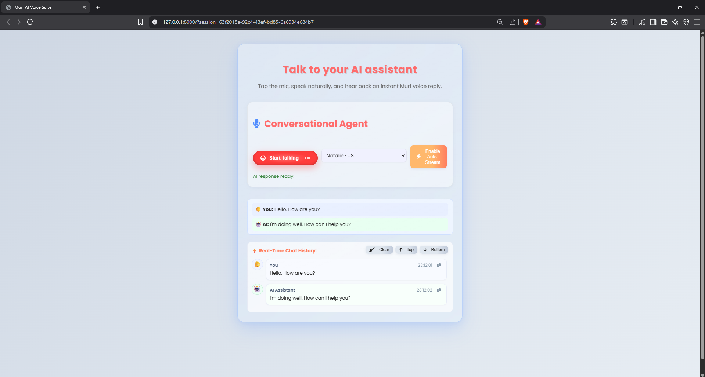

# 🎙️  AI Assistant

A lightweight voice-first assistant built with FastAPI that lets you talk to an AI and hear it talk back. It records your voice in the browser, transcribes it (AssemblyAI), gets a response from an LLM (Google Gemini), and speaks the answer using Murf TTS. A simple chat history panel shows the back-and-forth.

The app is designed to be resilient: if any external API is unavailable, it falls back to a friendly text response so the UI never blocks.

## ✨ Features

- Voice in, voice out: record in the browser, hear an immediate reply
- Works with AssemblyAI (STT), Google Gemini (LLM), and Murf (TTS)
- Clean FastAPI backend + static HTML/CSS/JS frontend
- Session-based chat history (/agent/history)
- Defensive error handling and service fallbacks


## 🛠 Tech Stack

- Backend: FastAPI, Starlette, Uvicorn, Pydantic, python-dotenv
- External services: AssemblyAI (speech-to-text), Google Generative AI (Gemini), Murf (text-to-speech)
- Frontend: Vanilla HTML, CSS, and JavaScript (no build tools required)


## 📂 Project Structure

.
├─ main.py                   # FastAPI application
├─ templates/
│  └─ index.html             # Frontend UI (record button, chat history)
├─ static/
│  └─ style.css              # Styles for the UI
├─ uploads/                  # Created at runtime for file uploads
└─ .venv/                    # Optional local virtual environment (if present)
```

## 🔄 How It Works

1. Browser captures audio via MediaRecorder
2. POST /agent/chat/{session_id}
   - If audio is provided, transcribe with AssemblyAI
   - Build a compact prompt from session history
   - Call Gemini LLM for a response
   - Split long responses and generate TTS with Murf, return playable URLs
   - Append user and assistant messages to in-memory history
3. Frontend autoplays the TTS audio chunks and renders history

In-memory chat history is keyed by session_id (persisted in the page URL). No database is required.


## 🔑 Environment Variables

Environment variables
Create a .env file in the project root with the following keys. The app handles missing keys gracefully with fallbacks, but features will be disabled accordingly.

- ASSEMBLYAI_API_KEY = your AssemblyAI key (enables STT)
- GEMINI_API_KEY = your Google Generative AI key (enables LLM)
- MURF_API_KEY = your Murf key (enables TTS)

Example .env:
ASSEMBLYAI_API_KEY=...
GEMINI_API_KEY=...
MURF_API_KEY=...
```


# 🚀 Running Locally (Windows PowerShell)
Prerequisites: Python 3.10+ recommended.

1) Create and activate a virtual environment
```
python -m venv .venv
. .venv\Scripts\Activate.ps1
```

2) Install dependencies
```
pip install fastapi uvicorn[standard] python-dotenv jinja2 assemblyai murf google-generativeai
```

3) Create a .env with your API keys (see above)

4) Start the API server
```
uvicorn main:app --host 127.0.0.1 --port 8000 --reload
```

5) Open the UI
- Navigate to http://127.0.0.1:8000
- Click “Start Talking”, speak, then click again to stop and send
- Toggle auto-stream if you want continuous turns

Note: On first use, your browser will ask for microphone permission.


## API reference (summary)
- GET  /                      → Renders the UI
- POST /generate-tts          → {text, voice_id} → Murf MP3 URL or fallback
- POST /upload-audio          → Accepts a file, returns metadata
- POST /transcribe/file       → Transcribes audio via AssemblyAI
- GET  /voices                → Lists voices from Murf (if available)
- POST /tts/echo              → Transcribe + re-speak (simple echo bot)
- POST /llm/query             → Text or audio → LLM → optional TTS
- POST /agent/chat/{session}  → Conversation turn with history + TTS
- GET  /agent/history/{session}
  - Returns: `{ session_id, history: [{ role, content, ts }] }`
- DELETE /agent/history/{session}
  - Clears the in-memory history for that session

All endpoints return graceful fallbacks if an upstream provider is unavailable.


## Screenshots




## Troubleshooting
- Microphone blocked? Re-enable permissions in your browser’s site settings.
- No audio reply? The app may be using a text fallback if Murf is unavailable—check the status text under the record button and your .env keys.
- CORS/localhost issues? Use the default http://127.0.0.1:8000 and keep the server and page on the same origin.


