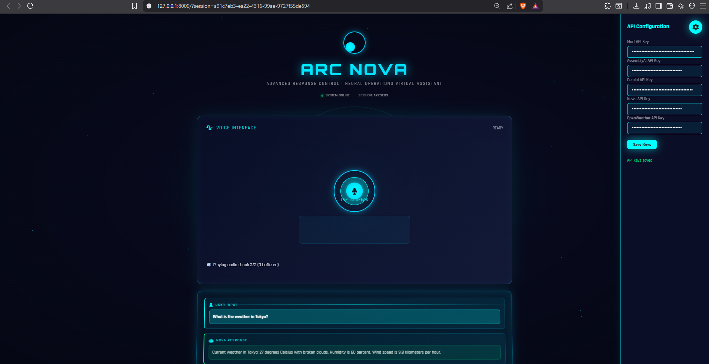

# 🤖 ArcNova Voice Assistant - Tony Stark AI

> *"Well, well, well… look who booted me up. I'm ArcNova — your genius, billionaire, playboy, philanthropist voice agent."*

A voice-first AI assistant with the personality of Tony Stark/Iron Man. Built with FastAPI, this assistant lets you have natural conversations with an AI that responds with wit, sarcasm, and genius-level confidence. It records your voice in the browser, transcribes it (AssemblyAI), gets a response from an LLM (Google Gemini), and speaks back in a male voice using Murf TTS.

## 🎭 ArcNova Persona
- **Personality**: Sarcastic, witty, cocky but charming
- **Voice**: Male (en-US-maverick) - commanding and confident
- **Style**: Tech metaphors, billionaire jokes, treats problems as trivial
- **Signature Greeting**: Triggers on "hello", "hi", "hey", etc.

## ✨ Features

- Voice in, voice out: record in the browser, hear an immediate reply
- Real-time streaming: Utilizes WebSockets for a seamless, real-time conversational experience.
- Works with AssemblyAI (STT), Google Gemini (LLM), and Murf (TTS)
- Clean FastAPI backend + static HTML/CSS/JS frontend
- Modular Skills System: Easily extendable with new capabilities. Current skills include:
News: Get the latest headlines, search for articles, and get news by category or country.
Weather: Get the current weather, forecasts, and air quality for any city.

- Dynamic API Key Configuration: Configure API keys through a web interface, with user-provided keys taking priority over environment variables.
- Session-based chat history (/agent/history)
- Defensive error handling and service fallbacks


## 🛠 Tech Stack

- Backend: FastAPI, Starlette, Uvicorn, Pydantic, python-dotenv
- External services: AssemblyAI (speech-to-text), Google Generative AI (Gemini), Murf (text-to-speech)
- Frontend: Vanilla HTML, CSS, and JavaScript (no build tools required)


## 📂 Project Structure
```

├── main.py                   # FastAPI application
├── services/                 # Modules for interacting with external APIs
│   ├── llm.py
│   ├── stt.py
│   ├── tts.py
│   ├── news.py
│   └── weather.py
├── skills/                   # Modules for handling specific agent capabilities
│   ├── news_skill.py
│   └── weather_skill.py
├── templates/
│   └── index.html            # Frontend UI
├── static/
│   └── style.css             # Styles for the UI
├── personas.py               # Defines the AI's personality
├── config.py                 # Handles environment variables
├── api_config.py             # Manages API key configuration
├── requirements.txt          # Python dependencies
└── README.md                 # This file
```

## 🔄 How It Works

1. Browser captures audio via MediaRecorder
2. The audio is streamed to the backend via a WebSocket.
3. The backend forwards the audio to AssemblyAI for real-time transcription.
4. Once a complete phrase is transcribed, it's sent to the Google Gemini LLM, along with the chat history, for a response.
5. The LLM's response is streamed back to the browser and simultaneously sent to the Murf TTS API to generate audio.
6. The frontend plays the TTS audio and displays the conversation in the chat history.


# 🚀 Running Locally (Windows PowerShell)
Prerequisites: 
Python 3.10+ recommended.
API keys for:
- AssemblyAI (Speech-to-Text)
- Google Gemini (LLM)
- Murf (Text-to-Speech)
- NewsAPI (for the news skill)

OpenWeatherMap (for the weather skill)

1) Create and activate a virtual environment
```
python -m venv .venv
. .venv\Scripts\Activate.ps1
```

2) Install dependencies
```
pip install fastapi uvicorn[standard] python-dotenv jinja2 assemblyai murf google-generativeai

or

pip install -r requirements.txt
```

3) Configure API Keys:
```
You can either create a .env file in the project root with your API keys (see the "Configuration" section below) or configure them through the web interface after starting the application.
```
4) Start the API server
```
uvicorn main:app --host 127.0.0.1 --port 8000 --reload
```

5) Open the UI
- Navigate to http://127.0.0.1:8000
- If you haven't configured your API keys in a .env file, click the settings icon in the top right to open the API configuration sidebar and enter your keys.
- Click the microphone button to start talking, and click it again to stop and send your message.

Note: On first use, your browser will ask for microphone permission.


## API reference (summary)
- GET    /                      → Renders the UI
- POST   /generate-tts          → {text, voice_id} → Murf MP3 URL or fallback
- POST   /upload-audio          → Accepts a file, returns metadata
- POST   /transcribe/file       → Transcribes audio via AssemblyAI
- GET    /voices                → Lists voices from Murf (if available)
- POST   /tts/echo              → Transcribe + re-speak (simple echo bot)
- POST   /llm/query             → Text or audio → LLM → optional TTS
- POST   /agent/chat/{session}  → Conversation turn with history + TTS
- GET    /agent/history/{session}  
  - Returns: `{ session_id, history: [{ role, content, ts }] }`
- DELETE /agent/history/{session}  
  - Clears the in-memory history for that session
- GET    /news/headlines        → Get latest news headlines
- POST   /news/search           → Search for news articles
- GET    /weather/current       → Get current weather for a city
- GET    /weather/forecast      → Get weather forecast for a city
- GET    /weather/air-quality   → Get air quality for a city
- GET    /config/status         → Get the status of all API configurations
- POST   /config/save           → Save user-provided API keys
- WS     /ws/audio              → WebSocket endpoint for real-time audio streaming


All endpoints return graceful fallbacks if an upstream provider is unavailable.


## Screenshots




## Troubleshooting
- Microphone blocked? Re-enable permissions in your browser’s site settings.
- No audio reply? The app may be using a text fallback if Murf is unavailable—check the status text under the record button and your .env keys.
- CORS/localhost issues? Use the default http://127.0.0.1:8000 and keep the server and page on the same origin.
- API Failures: Check all your API keys in the .env file or the web interface, verify your internet connectivity, and review your API rate limits and quotas with each provider


